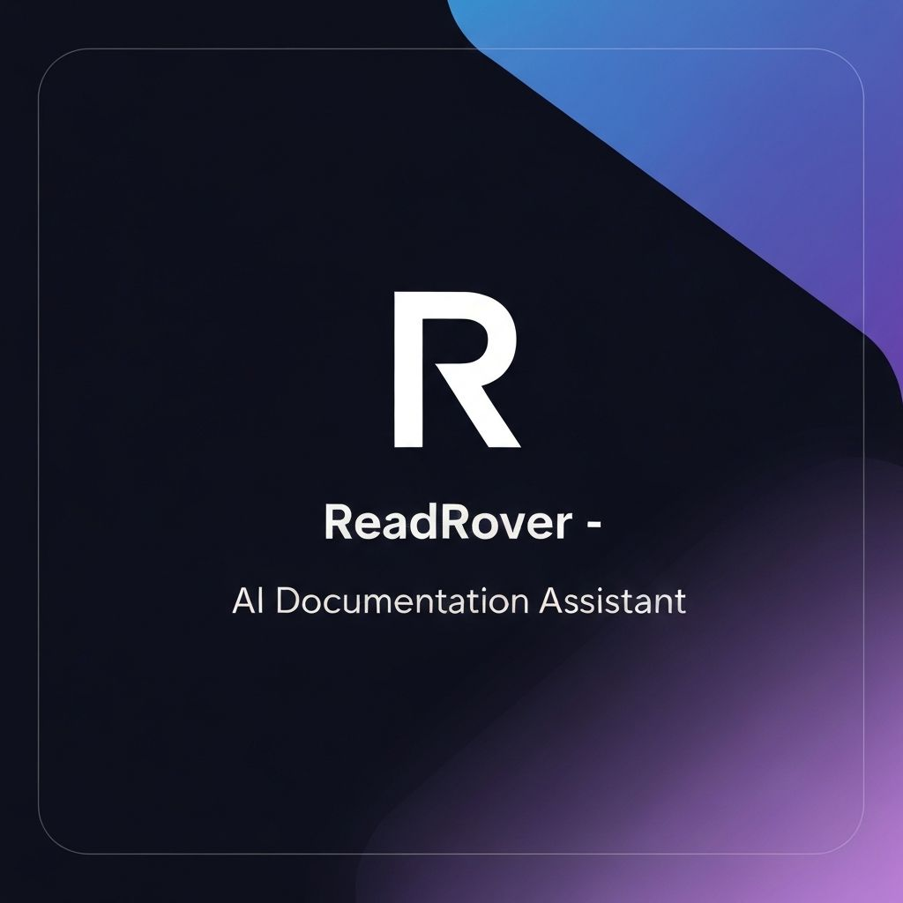

# InsightAI

**Stop reading lengthy documentation. Start chatting with AI.**

InsightAI is an AI-powered documentation assistant that transforms the way developers and students interact with technical documentation and study materials. Simply paste a URL, upload a PDF, or scan an image — and get instant answers, summaries, and explanations.

## Inspiration

We've all been there — staring at 300-page documentation, trying to find that one configuration option or API method. Or struggling through dense academic PDFs before an exam. Reading documentation is time-consuming, often confusing, and frankly, exhausting.

**The problem:** Developers waste hours reading through documentation just to implement simple features. Students struggle to extract key concepts from lengthy study materials.

**Our solution:** What if AI could read documentation for you, understand it deeply, and answer any question you have — in seconds?

That's how InsightAI was born.

## What it does

InsightAI offers two specialized modes:

### Developer Mode
- **Documentation Assistant:** Paste any documentation URL and AI crawls the entire site, indexing all pages
- **Instant Answers:** Ask questions about APIs, configurations, best practices — get code examples and implementation guides
- **Multi-format Support:** Upload PDFs, paste URLs, or scan screenshots of code/diagrams
- **Intelligent Crawling:** AI reads up to 50 documentation pages, extracting clean content while ignoring navigation and ads

### Learning Mode
- **AI Tutor:** Upload study materials (PDFs, lecture notes) and get comprehensive summaries
- **Auto-Generated Study Tools:**
  - Flashcards with spaced repetition
  - Practice quizzes with timed mode
  - Summary notes highlighting key concepts
- **Interactive Q&A:** Ask follow-up questions and get step-by-step explanations with examples
- **Visual Learning:** AI generates diagrams and visual aids to explain complex topics

### Core Features
- **Conversational Text-to-Speech:** Messages convert to natural, conversational audio (not robotic)
- **Message Editing:** Edit your questions and regenerate AI responses
- **Syntax Highlighting:** Code blocks rendered beautifully with copy buttons
- **Separate Chat Histories:** Dev and Learning modes maintain independent conversation histories
- **Mobile Responsive:** Fully optimized sidebar that collapses on mobile devices
- **Export & Settings:** Export chat history, customize themes, adjust text size

## How we built it

### Tech Stack

**Frontend:**
- Next.js 16 (React 19.2)
- TypeScript
- Tailwind CSS 4
- Radix UI (shadcn/ui components)
- React Markdown with syntax highlighting

**Backend & APIs:**
- Next.js API Routes (serverless)
- Groq API (llama-3.3-70b-versatile for chat)
- SiliconFlow API (DeepSeek-V3 fallback, image OCR, diagram generation)
- iFlytek API (high-quality text-to-speech)
- PDF.co API (PDF text extraction)
- Cheerio (HTML parsing for web scraping)

**Storage & State:**
- LocalStorage (client-side chat persistence)
- Session management with mode-specific histories

### Architecture

1. **Web Crawling Pipeline:**
   - URL submitted → Cheerio scrapes HTML → Extract clean text content
   - Find all internal documentation links → Crawl up to 50 pages
   - Chunk large content → Process each chunk with AI → Merge insights

2. **AI Processing:**
   - Groq API generates comprehensive summaries with key points
   - For education mode: Auto-generates flashcards, quizzes, and study guides
   - For dev mode: Extracts code examples, API references, and best practices

3. **File Processing:**
   - PDFs → PDF.co extracts text → Send to AI for analysis
   - Images → SiliconFlow vision model (OCR) → Extract text → Process

4. **Text-to-Speech Pipeline:**
   - User clicks "Read Aloud" → Message sent to Groq to generate conversational script
   - Script removes code symbols (// becomes "comment", etc.)
   - iFlytek TTS API converts to natural speech → Audio playback

### Key Innovations

- **Chunked Processing:** Large documentation split into digestible chunks, processed in parallel, then merged intelligently
- **Conversational TTS:** AI rewrites technical content into natural speech before synthesis
- **Mode-Specific Prompts:** Different system prompts optimize AI responses for developers vs. learners
- **Smart Caching:** Chat histories persist locally with separate storage keys per mode
- **Fallback Architecture:** SiliconFlow (DeepSeek) kicks in when Groq hits rate limits

## Challenges we ran into

1. **Documentation Crawling at Scale**
   - **Problem:** Some docs sites have 1000+ pages. Crawling everything times out.
   - **Solution:** Implemented intelligent prioritization (prioritize /docs/, /api/, /guide/ paths) and capped at 50 pages with 10-page chunking for AI processing.

2. **API Rate Limits**
   - **Problem:** Groq API has rate limits; app would fail during heavy use.
   - **Solution:** Built automatic fallback to SiliconFlow's DeepSeek-V3 model with seamless error handling.

3. **Text-to-Speech Quality**
   - **Problem:** TTS reading code like "slash slash" for comments sounded robotic.
   - **Solution:** Pre-process with Groq to convert technical syntax into conversational language before TTS.

4. **Mobile Responsiveness**
   - **Problem:** Sidebar and chat layout broke on mobile screens.
   - **Solution:** Implemented responsive breakpoints with collapsible sidebar overlay for mobile.

5. **Security Concerns**
   - **Problem:** Initially exposed API keys in client-side code.
   - **Solution:** Moved all API calls to server-side Next.js API routes with environment variables.

## Accomplishments that we're proud of

- **Production-Grade UI/UX:** Not "AI-generated" looking — polished, modern design with smooth animations and micro-interactions
- **Dual-Mode Intelligence:** One app serving two distinct use cases (developers & students) with optimized experiences for each
- **Multi-Modal Input:** URLs, PDFs, images — handles everything seamlessly
- **Real-World Testing:** Tested with actual documentation (Next.js, React, Tailwind) and academic PDFs
- **Performance:** Fast response times even with large documents (50-page docs processed in ~15-20 seconds)
- **Accessibility:** Proper ARIA labels, keyboard navigation, high contrast ratios

## What we learned

### Technical Learnings
- **Web scraping is hard:** Not all documentation sites are structured the same. We learned to handle edge cases like JavaScript-rendered content, nested navigation, and dynamic routes.
- **AI prompt engineering matters:** Small changes to system prompts drastically improved response quality. Education mode prompts needed more patience and examples; dev mode needed conciseness.
- **Chunking is essential:** Large documents can't be processed in one API call. Smart chunking with context preservation is critical.

### Product Learnings
- **Users want instant value:** The "upload and wait" pattern doesn't work. We show suggested questions and actions immediately after file upload.
- **Context matters:** Developers want code examples; students want explanations and practice materials. One-size-fits-all doesn't work.
- **Audio quality matters:** Bad TTS ruins the experience. We invested time in conversational script generation to make audio pleasant.

### Design Learnings
- **Sidebar UX patterns:** Studied ChatGPT, Claude, and Perplexity to understand what works. Rename-on-hover, message previews, and drag-to-resize are table stakes.
- **Loading states:** Never show blank screens. Skeleton loaders, progress indicators, and suggested prompts keep users engaged.

## What's next for InsightAI

### Short-term (Next 2-4 weeks)
- **Collaborative Chats:** Share chat links with teammates or classmates
- **Export Formats:** Download conversations as PDF or Markdown
- **Voice Input:** Speak questions instead of typing
- **Code Execution:** Run code examples directly in the chat

### Medium-term (1-3 months)
- **Chrome Extension:** Highlight any text on a webpage and ask AI to explain it
- **Integrations:** Connect with Notion, Google Drive, Dropbox for direct file access
- **Team Workspaces:** Organizations can share knowledge bases and chat histories
- **Custom AI Models:** Train on company-specific documentation

### Long-term (6+ months)
- **Mobile Apps:** Native iOS and Android apps with offline support
- **API Marketplace:** Let developers build custom integrations
- **Enterprise Features:** SSO, audit logs, compliance certifications
- **Multilingual Support:** Support for 20+ languages beyond English

---

## Getting Started

### Prerequisites
- Node.js 18+ and npm/yarn/pnpm
- API keys (see Environment Variables below)

### Installation

\`\`\`bash
# Clone the repository
git clone https://github.com/yourusername/insightai.git
cd insightai

# Install dependencies
npm install

# Set up environment variables (see below)
cp .env.example .env.local

# Run development server
npm run dev
\`\`\`

Open [http://localhost:3000](http://localhost:3000) in your browser.

### Environment Variables

Create a `.env.local` file with the following:

\`\`\`env
# Groq API (primary LLM)
GROQ_API_KEY=your_groq_api_key

# SiliconFlow API (fallback LLM + vision + diagrams)
SILICONFLOW_API_KEY=your_siliconflow_api_key

# iFlytek API (text-to-speech)
IFLYTEK_API_KEY=your_iflytek_api_key

# PDF.co API (PDF extraction)
PDFCO_API_KEY=your_pdfco_api_key
\`\`\`

**Getting API Keys:**
- Groq: [console.groq.com](https://console.groq.com)
- SiliconFlow: [cloud.siliconflow.cn](https://cloud.siliconflow.cn)
- iFlytek: [www.xfyun.cn](https://www.xfyun.cn)
- PDF.co: [app.pdf.co](https://app.pdf.co)

### Build for Production

\`\`\`bash
npm run build
npm start
\`\`\`

## Project Structure

\`\`\`
insightai/
├── app/
│   ├── api/              # Next.js API routes
│   │   ├── chat-docs/    # Main chat endpoint
│   │   ├── scrape-docs/  # Documentation crawler
│   │   ├── extract-file/ # PDF/image processing
│   │   ├── tts/          # Text-to-speech
│   │   └── generate-tts-script/ # TTS script generation
│   ├── page.tsx          # Homepage with mode selection
│   ├── layout.tsx        # Root layout
│   └── globals.css       # Global styles
├── components/
│   ├── chat-interface.tsx  # Main chat container
│   ├── chat-sidebar.tsx    # Conversation history
│   ├── chat-view.tsx       # Messages and input
│   ├── message-bubble.tsx  # Individual message rendering
│   ├── settings-modal.tsx  # App settings
│   └── ui/               # Reusable UI components
├── public/
│   ├── favicon.svg       # Site icon
│   └── og-image.jpg      # Social sharing image
└── README.md
\`\`\`

## Contributing

i welcome contributions! Please see [CONTRIBUTING.md](./CONTRIBUTING.md) for guidelines.

## License

MIT License - see [LICENSE](./LICENSE) for details.

---

**Built with ❤️ by Reabot6**

© 2025 Reabot6. All rights reserved.

[Website](https://insightai.vercel.app) • [x](https://X.com/reabot6) • [linkedin](https://www.linkedin.com/in/onimisi-adeiza-bb2035254/)
